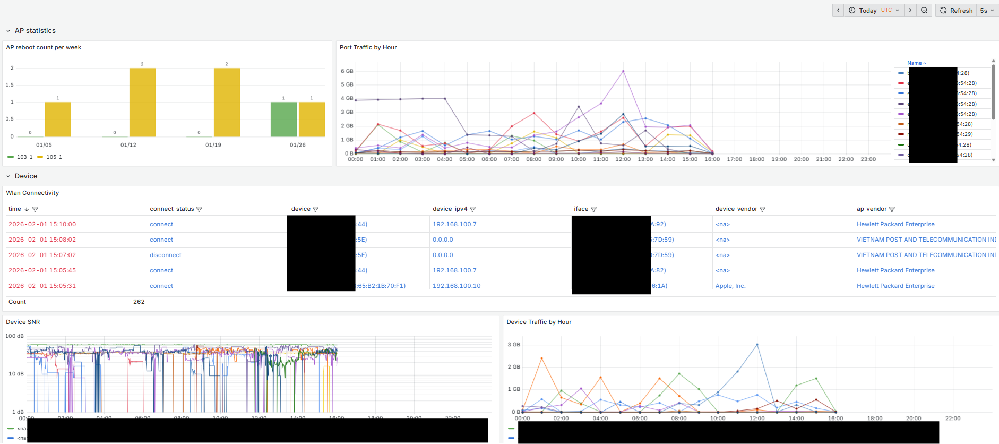
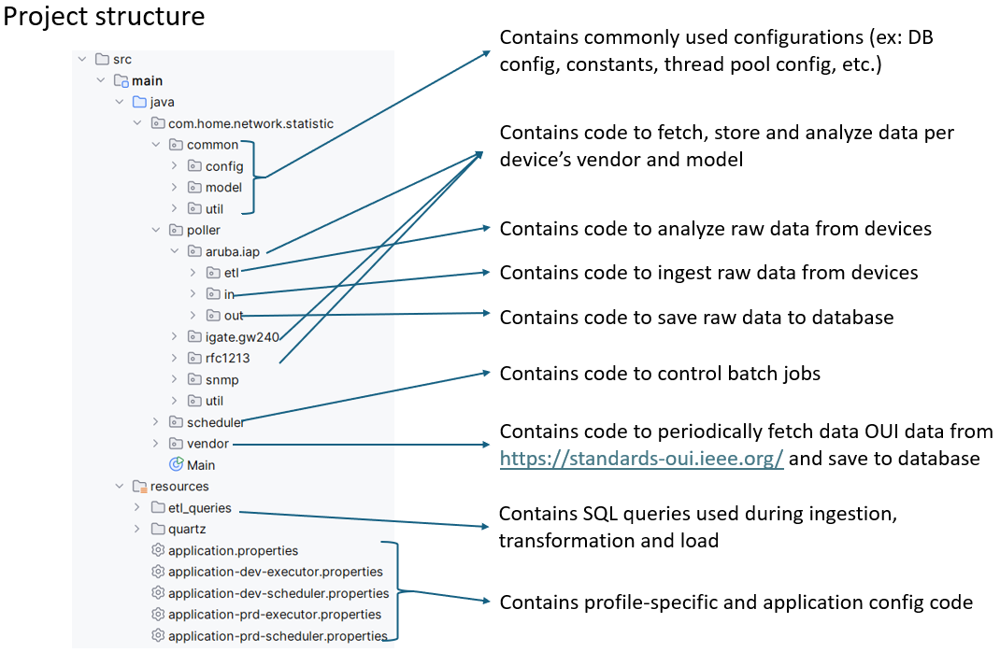
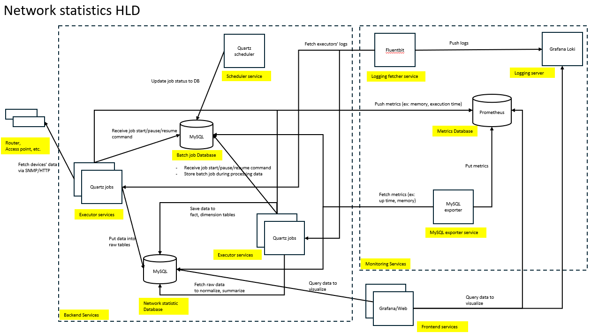

# Description
A project used to ingest and analyze data from internal network devices, featuring clients and access points' traffic, client disconnect/connect events and router's reboot events.



## Tech stack
- Backend: Spring framework, Spring JDBC Template, Quartz Scheduler, SNMP4J, Swagger
- Frontend: Grafana
- DB: MySQL

## Project structure


## High level design


# Profile info
- dev-executor: used to run executor instances outside container environment with direct IP (ex: 192.168.100.1)  
- dev-scheduler: used to run scheduler instances outside container environment with direct IP (ex: 192.168.100.1)
- prd-executor: used to run executor instances inside container environment using container hostname (ex: mysql)
- prd-scheduler:  used to run scheduler instances inside container environment using container hostname (ex: mysql)

# Create archive, staging, ingestion table
```sql
CREATE TABLE `<data>_stg` (
                           `id` int NOT NULL AUTO_INCREMENT,
                           `poll_time` datetime NOT NULL,
                           `raw_data` json DEFAULT NULL COMMENT 'use json to handle schema change',
                           PRIMARY KEY (`id`,`poll_time`)
) ENGINE=InnoDB AUTO_INCREMENT=2 DEFAULT CHARSET=latin1;
create table <data>_archive like <data>_stg;
create table <data>_stg_ingest like <data>_stg;
alter table <data>_archive partition by range (year(poll_time))
(
    partition p2025 values less than(2025) engine = innodb,
    partition p2026 values less than(2026) engine = innodb,
    partition p2027 values less than(2027) engine = innodb,
    partition p2028 values less than(2028) engine = innodb,
    partition p2029 values less than(2029) engine = innodb,
    partition p2030 values less than(2030) engine = innodb,
    partition p9999 values less than(9999) engine = innodb
);
```

# Development procedures for new device models/versions
1. Create a new package related to new models under vendor package (ex: deco under tplink)
2. Put related classes into etl, in, out packages indicating ETL flow, ingestion and persistence logic, respectively
   2.1. Create job classes in etl and in packages to define Quartz jobs
   2.2. Create service classes in etl and in packages to define logic workflows associated with job classes
      2.2.1. Service classes inside "in" responsible for handling data ingestion
      2.2.2. Service classes inside "etl" responsible for handling data normalization and summarization
   2.3. Create model classes in etl, in, and out packages to hold the business logic of workflows
   2.4. Create repository classes in out package to handle the logic of data persistence
3. Create db schemas - archive, staging, ingestion tables related to new device data in the database
4. Create new sql files for the workflows of new models in resources/etc_queries folder
5. Update the size of thread pool to run jobs in src/main/java/com/home/network/statistic/common/config/quartz/AppQuartzThreadPool.java, if necessary
6. Update src/main/java/com/home/network/statistic/common/config/ExecutorDataSourceConfig.java to declare new repository packages to scan
7. Update src/main/java/com/home/network/statistic/common/config/SqlQueryConfig.java to declare new sql query resource locations
8. Update *properties files to define new threadpool size configs for new jobs
9. Declare quartz new quartz triggers, job details in through scheduler interface
Example request for new job details:
```json
{
  "schedulerId": "quartzSchedulerPollData",
  "jobClassName": "com.home.network.statistic.poller.tplink.deco.in.FetchTelemetryJob",
  "jobNm": "fetchTplinkDecoTelemetry",
  "jobGr": "JOB",
  "isDurable": true,
  "requestsRecovery": true
}
```
Example request for new triggers:
```json
{
  "schedulerId": "quartzSchedulerETL",
  "triggerName": "triggerTpLinkDecoClientDeviceInfo",
  "triggerGroup": "TRIGGER",
  "jobName": "etlTpLinkDecoClientDeviceInfo",
  "jobGroup": "JOB",
  "cronTriggerCronExpression": "0 1/10 * * * ?",
  "cronTriggerTimeZone": "Asia/Saigon",
  "cronTrigger": true,
  "simpleTrigger": false,
  "dailyTimeIntervalTrigger": false
}
```

# Deployment procedures
1. Create a new branch from main to implement changes 
2. Test and debug on local using a dev database
3. If local test passes, deploy on a dev environment
4. Monitor dev outputs, if all outputs satistfied, deploy on prd
5. Merge code to main

# Common tasks
Run unit tests
```
gradle test
```

Run spring application from IntellJ
```
gradle bootRun
```

Build and skip test
```
gradle clean build -x test
```

# Run on dev pofile - local
Run executor  from java command line
```
java '-Dspring.profiles.active=dev-executor' -jar ./build/libs/network-statistic-0.0.1-SNAPSHOT.jar
```

Run dev scheduler from java cmd
```
java '-Dspring.profiles.active=dev-scheduler' -jar ./build/libs/network-statistic-0.0.1-SNAPSHOT.jar
```

Run dev admin from java cmd
```
java '-Dspring.profiles.active=dev-admin' -jar ./build/libs/network-statistic-0.0.1-SNAPSHOT.jar
```

# Run inside container
Run executor  from java command line
```
java '-Dspring.profiles.active=prd-executor' -jar ./build/libs/network-statistic-0.0.1-SNAPSHOT.jar
```

Run scheduler from java cmd
```
java '-Dspring.profiles.active=prd-scheduler' -jar ./build/libs/network-statistic-0.0.1-SNAPSHOT.jar
```

Run executor  from bash shell
```
java -Xmx256m -Dspring.profiles.active=prd-executor -jar network-statistic-0.0.1-SNAPSHOT.jar
```

Run executor  from bash shell
```
java -Xmx256m -Dspring.profiles.active=prd-scheduler -jar network-statistic-0.0.1-SNAPSHOT.jar
```

